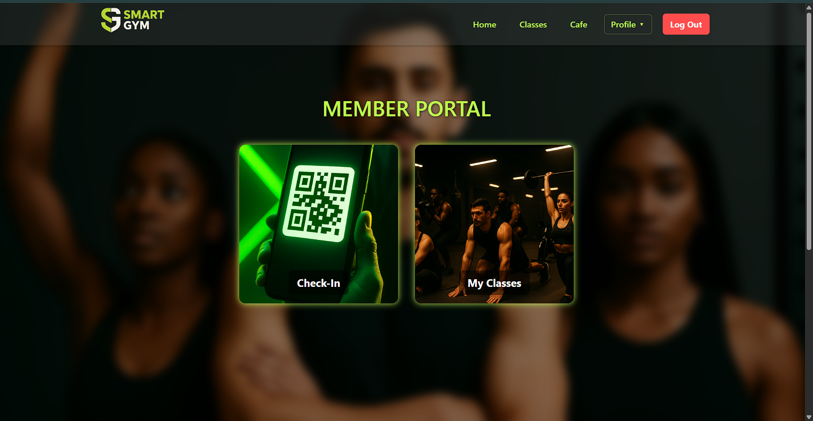
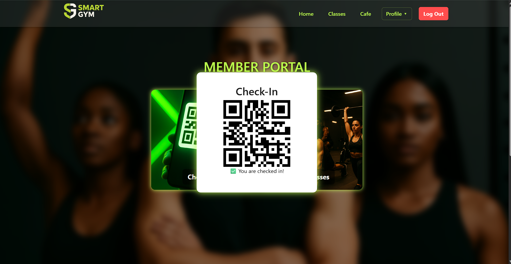
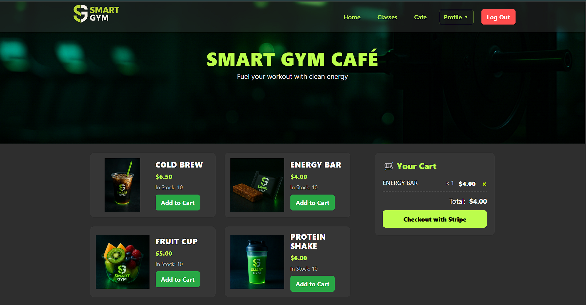
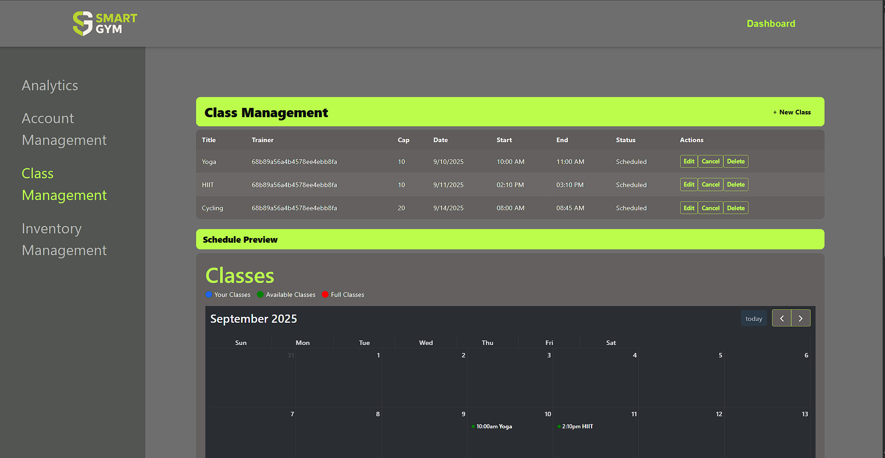
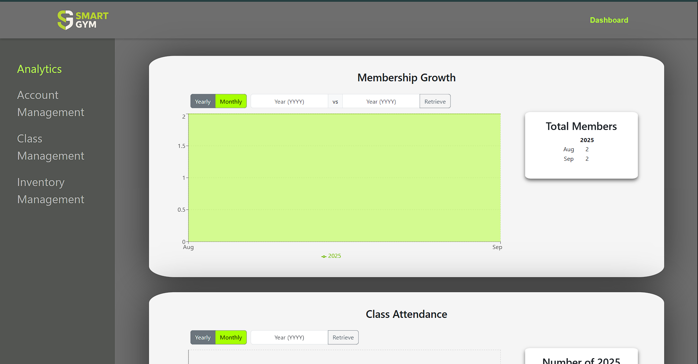

# Smart Gym

Smart Gym is a full-stack fitness management platform designed to streamline gym operations, enhance member experience, and provide robust analytics for gym owners and staff.

[Live Demo](https://smart-gym-jxxx.onrender.com/)


## Project Origin

This project was started under the **Dallas Software Developers Cohort (July–August 2025)** with the following team members:
- **Alex Appleget** — alexappleget2014@gmail.com
- **Alexia Moore** — alexiashalise@gmail.com
- **Carmen Wheeler** — carmenwh33l3r@gmail.com
- **David De La Rosa** — ddrosa93@gmail.com
- **Julio Rodriguez**
- **Sai Krishna**

After the cohort, **Alexia Moore**, **David De La Rosa**, and **Carmen Wheeler** continued to develop and refine the project.

---

## My Contributions (Carmen Wheeler)

As a core developer and project maintainer, my contributions include:

- **Frontend Development**
  - Designed and implemented the Member Portal UI, including dashboard tiles, check-in/QR modal, and class management views.
  - Built the Smart Gym Café ordering interface, cart, and Stripe payment integration.
  - Developed responsive layouts and custom CSS for a modern, accessible user experience.
  - Integrated calendar and scheduling features for class management.

- **Backend/API**
  - Developed and maintained Express.js REST API endpoints for user authentication, class scheduling, inventory, and analytics.
  - Implemented MongoDB models and data access logic for members, classes, and café inventory.
  - Set up secure environment variable management and deployment scripts.

- **Full Stack Features**
  - Led the integration of Stripe payments for café purchases.
  - Built the QR code check-in system, including backend generation and frontend scanning/validation.
  - Implemented role-based access control for admin and member features.
  - Wrote documentation and onboarding guides for new contributors.

- **Project Management & Collaboration**
  - Coordinated feature planning and code reviews with Alexia and David.
  - Managed GitHub issues, pull requests, and release cycles.
  - Led post-cohort development, prioritizing features and bug fixes based on user feedback.

---

## Tech Stack

- **Frontend:** React, TypeScript, Vite, CSS Modules
- **Backend:** Node.js, Express.js, MongoDB, Mongoose
- **Payments:** Stripe API
- **Other:** JWT Auth, RESTful APIs, GitHub Actions (CI/CD)

---


## Screenshots

### Login Screen


### Membership Portal


### Member Checkin


### Smart Gym Café


### Admin Class Management


### Admin Analytics



## Getting Started

1. Clone the repo:
  ```bash
  git clone https://github.com/OutsideofemiT/Smart-Gym.git
  ```
2. Install dependencies for both frontend and backend.
3. Set up your `.env` files (see `.env.example`).
4. Run the backend and frontend servers.
5. Access the app at `http://localhost:3000` (or your configured port).

---
## How to Use Smart Gym

### Sign Up & Member Portal

- Click **Join Today** to register as a new member (payment is not required for sign-up).
- After sign-up, you’ll enter your **Member Portal**.

#### Profile Setup

- Access your profile from the navigation menu.
- Set your profile details and upload a profile image (default avatar with initials if none uploaded).

#### Member Features

- **Check-In:** Scan your personal QR code in-app at the gym.
- **Classes:** View, sign up for, and manage your fitness classes.
- **Smart Gym Café:** Order from the café directly; Stripe payment is enabled for purchases.

    - **For testing Stripe payments:**  
      Use card number `4242 4242 4242 4242`, any future expiry date, and any 3-digit CVV.

- **Account Management:** Update your personal info and membership settings.

---

### Admin Dashboard Access

Use these demo admin credentials to explore the dashboard:

- **Email:** admin@email.com
- **Password:** 123123123

Admin features include:
- Viewing analytics
- Managing classes and members
- Overseeing café inventory
- Full admin account controls

---

### Trainer Calendar

Trainer demo credentials:

- **Email:** trainer1@email.com
- **Password:** 12341234

Trainer features:
- View/manage training schedule and class assignments.

---

**Notes:**
- All main features are in the Member Portal—access after sign-up.
- Admin and trainer dashboards require demo account logins above.
- Stripe payment for café orders is test mode only (see card info above).
- This project is a work in progress; features and UI may change.


## License

This project is open source and available under the MIT License.
